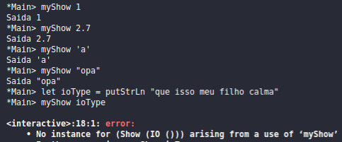
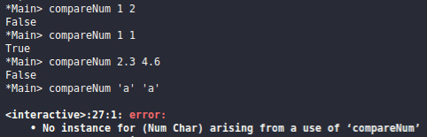
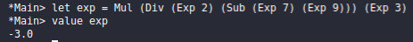
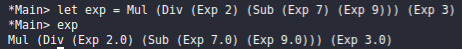
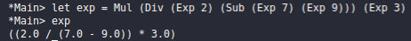
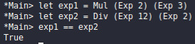
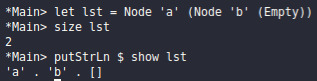
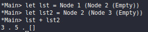
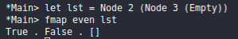
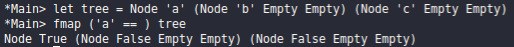

# Sim, o Flávio está atrasado
# 1. Classes, Datatypes e Instances
Em Haskell, a todo momento usamos os mesmos operadores para diferentes tipos de dados. O maior exemplo disso é o operador “==” que verifica igualdade. 1 == 1 é verdadeiro, mas “opa” == “opa” também é. Usar funções para tipos diferentes, desta forma, é algo que parece trivial, mas esconde um segredo assustador dentro da linguagem: classes.

As classes em Haskell são bem diferentes das de Java. Primeiramente, as classes aqui funcionam como um dicionário de possíveis métodos que podem ser utilizados. Em paralelo à outras linguagens, uma classe é como uma interface: ela mantém quais são os métodos, mas não os implementa.

Por exemplo, a classe Eq, padrão do módulo Prelude, trás as funções que implementam as verificações de igualdade e desigualdade:
    
```
class Eq a where
  (==) :: a -> a -> Bool
  (\=) :: a -> a -> Bool
  …
```

As implementações das funções == e /= dependem do tipo em que estão sendo aplicadas. Para 1 == 1 a linguagem faz uma coisa, para ‘a’ == ‘a’, outra coisa. Isso é definido com a palavra reservada “instance”, mas já chegaremos nessa parte.
A estrutura básica de uma classe é a seguinte:


```
class Nome a where
    --funções
    …
```

Onde “a” representa um parâmetro para o tipo. Se isso parece estranho, pense que outras funções também existem independentemente do tipo que estão recebendo. O (!!) que acessa índices de arrays não está se importando com o que há no array, tanto é que seu tipo é:

    
```
    (!!) :: [a] -> Int -> a
```
Outro exemplo é a função take:

```
    take :: Int -> [a] -> [a]
```

As definições dos métodos da classe são feitas dentro de instâncias. Essas nada mais são do que a especificação de como as funções devem se comportar dependendo do tipo de dado.

A instância da classe Eq para os tipos Char, Integer, Float e Double são as seguintes: 
    

```
instance Eq Char where
    (C# c1) == (C# c2) = c1 `eqChar#` c2
    (C# c1) /= (C# c2) = c1 `neChar#` c2

instance  Eq Integer  where
    (==) = eqInteger
    (/=) = neqInteger

instance Eq Float where
    (F# x) == (F# y) = x `eqFloat#` y --F# indica um float

instance Eq Double where
    (D# x) == (D# y) = x ==## y --D# indica um double

```

Para cada tipo, a comparação (==) é na verdade uma chamada a outra função mais primitiva, a qual é especializada em comparar determinado tipo de dado. Em suma, isso nos permite usar a mesma função/operador para todos os tipos de dados que são instanciados na classe Eq, sem a necessidade de usarmos uma função específica para cada tipo.

A estrutura de uma instância básica é:

```

instance NomeClasse Tipo where
     --comportamento das funções para o Tipo
     
```

Você pode conferir as funções e as instâncias de qualquer classe no terminal com o comando “:i NomeDaClasse”.

As principais classes que usamos são:

| Nome da Classe | O que faz  | Funções principais  | Instancias |
| :-: | :-: | :-: | :-: |
| Eq | Comparações de igualdade | (==), (/=) | Char, Double, Float, Int, Integer |
| Ord | Comparação de magnitude (maior, menor) | compare, (<), (<=), (>=), (>), max, min | Char, Double, Float, Int, Integer |
| Enum | Mapeamento dos valores (anterior, próximo) | succ, pred | Char, Double, Float, Int, Integer |
| Bounded | Limites máximos e mínimos para os valores de um tipo (Ex: o menor char possível é ‘\0’) | minBound, maxBound | Char, Int |
| Show | Printa valores na tela | show | (), [a], Char, Double, Float, Int, Integer |
| Num | Funções básicas para tipos numéricos | (+), (-), (*), abs, signum, negate, fromInteger | Double, Float, Int, Integer |
| Fractional | Funções para números racionais (divisões) | (/), recip | Double, Float |
| Floating | Funções para números reais | exp, log, sqrt, logBase, (**), sin, cos, tan | Double, Float |
| Integral | Operações com números inteiros | quot, rem, div, mod | Int, Integer |

Perceba que o fato de Int estar instanciado na classe Bound, mas Integer não, já nos mostra uma clara diferença entre estes dois tipos: Int é um tipo limitado, Integer não. Em outras palavras, existe um valor máximo e mínimo para um Int, mas um Integer sempre poderá ser maior, obviamente ocupando muito mais memória. 

Para verificar isso usamos a função minBound. Para que ela retorne o tipo inteiro, é necessário especificar “minBound::Int”. Tentar usar essas funções com um Integer gerará erro, pois o tipo não está instanciado na classe.

Outra característica importante das classes é que elas podem “herdar” funções de outras classes. A classe Ord, por exemplo, precisa que suas instâncias também estejam na classe Eq. A classe Fractional deriva de Num, e a classe Floating deriva de Fractional.
Isso é escrito da seguinte forma:
 
```
class (Num a) => Fractional a where
    (/) :: a -> a -> a
```

Isso implica que antes de eu poder usar a função (/) da classe Fractional em um número, eu preciso poder usar (+), (-), (*) etc. Já usávamos esta sintaxe em funções, para indicar que o parâmetro recebido pertence a alguma classe. Por exemplo, se temos uma função que printará alguma coisa na tela, precisamos que o parâmetro a ser printado esteja instanciado na classe Show:

```
myShow :: (Show a) => a -> IO()
myShow n = putStrLn $ “Saida ” ++ show n
```

O chamado “constraint” (restrição) ‘=>’ indica que todo parâmetro recebido do tipo ‘a’ precisa ser uma instância da classe Show. Isso permite que a restrição dos parâmetros das nossas funções não sejam o tipo, mas a classe.

Para o exemplo anterior, um tipo de dado que não é instanciado na classe show, como o tipo IO(), causará erro:



A classe Num, por exemplo, não está restrita a nenhuma outra. O que teoricamente não nos permitiria comparar dois números. Nós conseguimos fazer esta comparação porque os tipos numéricos (Int, Double etc.) são instâncias diretas da classe Eq. É meio estranho, mas é assim que o Haskell está estruturado.


```
Adendo: aparentemente o tipo Num não é contido em Ord porque os números complexos não podem ser ordenados.
```

Consequência disso é que se quisermos uma função que compara apenas números temos que indicar que o tipo recebido é uma instância numérica e que também aceita comparação de igualdade:


```
compareNum :: (Num a, Eq a) => a -> a -> Bool
compareNum n m = n == m
```

E os testes:



## 1.1 Criando nossas próprias classes e instâncias

Como um primeiro exemplo, fiz um tipo de data “Exp”, que representa uma expressão numérica. 

```
data Exp =  Exp Double  |
           Pow Exp Exp |
           Log Exp Exp |
           Mul Exp Exp |
           Div Exp Exp |
           Add Exp Exp |
           Sub Exp Exp
           deriving (Show)
```

```
Adendo: para não causar confusão, tenha em mente que “data” serve para declarar um novo tipo, enquanto “type” serve para dizer que dois tipos são a mesma coisa. 
```

Basicamente um dado Exp pode ser os seguintes construtores/tipos: O tipo Exp que mantém um Double, ou qualquer operador (soma, subtração etc.) entre outras duas Exp. Isso pode ser entendido como uma estrutura de árvore onde as folhas são o “Exp Double”, mas pensar assim pode só complicar mais as coisas.

Podemos agora criar infinitas funções que fazem coisas mirabolantes com as nossas expressões, mas para o propósito deste trabalho, vamos criar uma classe para elas:

Queremos poder avaliar o valor da nossa expressão numérica, então criaremos uma classe chamada Eval:

```
class Eval a where
  value :: a -> Double
```

A função “value” recebe o tipo ‘a’, que será instanciado depois, e retorna um Double.

Agora precisamos instanciar o tipo Exp na classe, onde definiremos a função value. Para isso:

```
instance Eval Exp where
   value (Exp n) = n
   value (Pow n m) = value n ** value m
   value (Log n m) = logBase (value n) (value m)
   value (Mul n m) = value n * value m
   value (Div n m) = value n / value m
   value (Add n m) = value n + value m
   value (Sub n m) = value n - value m
```

Parece complicado, mas no fundo trata-se casamento de padrões: se a nossa expressão for um “Pow”, caímos no segundo caso, se for apenas “Exp n” retornamos n etc.

E então testando:



Se quisermos printar na tela a expressão precisamos instanciá-la na classe Show. Podemos fazer isso por um atalho com “deriving”, da seguinte forma:

```
data Exp =  Exp Double  |
           Pow Exp Exp |
           Log Exp Exp |
           Mul Exp Exp |
           Div Exp Exp |
           Add Exp Exp |
           Sub Exp Exp
           deriving (Show)
```

E o resultado é:



Porém, ainda está muito difícil de acompanhar o que está acontecendo na expressão. Se instanciamos separadamente, podemos definir a nossa própria função de printar:

```
instance Show Exp where
   show (Exp n) = show n
   show (Pow n m) = "(" ++ show n ++ " ^ " ++ show m ++ ")"
   show (Log n m) = "(" ++ "Log(" ++ show n ++ ")(" ++ show m ++"))"
   show (Mul n m) = "(" ++ show n ++ " * " ++ show m ++ ")"
   show (Div n m) = "(" ++ show n ++ " / " ++ show m ++ ")"
   show (Add n m) = "(" ++ show n ++ " + " ++ show m ++ ")"
   show (Sub n m) = "(" ++ show n ++ " - " ++ show m ++ ")"
```

E o resultado é:



Podemos tentar instanciar Exp em mais classes que fazem sentido. Por exemplo, podemos querer avaliar a igualdade de duas expressões. Para fazer isso precisamos da classe Eq.  

Fazer isso é bem simples, pois só precisamos avaliar os valores das classes. Isso lembra muito as definições de igualdade que foram citadas anteriormente: onde a instância precisa usar outras funções para verificar a igualdade entre inteiros e floats, porque ainda não definiu o funcionamento de (==) para o tipo.

```
instance Eq Exp where
   n == m          = value n == value m
```

Agora podemos comparar duas expressões assim:



## 1.2 Linked Lists
Relembrando estruturas de dados, resolvemos implementar uma lista encadeada. Na verdade, este é um exemplo padrão de todo site que fala sobre datatypes. De qualquer forma, uma lista encadeada pode ser feita da seguinte forma:

```
data List a = Node a (List a) | Empty deriving (Eq)
```

O tipo ‘List a’, ou é um Node que mantém um elemento do tipo ‘a’ e um elemento do tipo da lista; ou é vazio (Empty), indicando o final da lista. Isso é chamado de “tipo recusivo”: uma lista é apenas um elemento seguido de uma lista, até que a lista seja vazia.

Vamos criar uma classe genérica para a lista. Primeiramente, vamos definir uma função que retorne o seu tamanho

```
class MyListClass a where
   size :: a -> Int
 
instance MyListClass (List a) where
   size (Node n ns) = 1 + size ns
   size Empty = 0
```

Também uma instância para printarmos a lista:

```
instance Show a => Show (List a) where
   show Empty = "[]"
   show (Node a as) = show a ++ " . " ++ show as
```

E o resultado:



Podemos querer somar (subtrair, multiplicar ou o que quer que seja) duas listas:

```
instance (Num a) => Num (List a) where
   Empty + Empty = Empty
   (Node n ns) + (Node m ms) = Node (n + m) (ns + ms)
   n + Empty = n
   Empty + n = n
```

O exemplo acima aplica a soma na lista, mas a ideia é válida para qualquer expressão. Isso é equivalente a um zipWith (+).



# 2 Functors
E se quisermos fazer algo como um filter? Passar por todos os elementos e saber quais deles é par, ímpar ou maior do que 42? Para este tipo de implementação, o Haskell possui a classe Functor. Ignorando toda a complexa teoria que paira sobre este nome, um functor é basicamente um “map” para funções e tipos.

```
class Functor f where
      fmap :: (a -> b) -> f a -> f b
```

fmap, a função básica dos functors, recebe uma função que está sendo aplicada do tipo a para o tipo b, e transforma ela para ser aplicada dentro do tipo b.
Basicamente, podemos instanciarr a nossa Lista em Functor da seguinte forma:

```
instance Functor (List a) where
    fmap f (Node n ns) = Node (f n) (fmap f ns)
    fmap f Empty = Empty
```
Isso está dizendo que, se aplicarmos alguma função ‘f’ na lista de elementos ‘n’, nós vamos, na verdade, estar aplicando a mesma função a cada elemento. 

Apenas com este trecho de código, já somos capazes de fazer coisas como:



E isso funciona para toda função que possa ser aplicada nos elementos do tipo ‘a’. O que o functor faz, é aplicar a função aos elementos, e manter os resultados ainda dentro de uma nova lista, ou qualquer estrutura que esteja sendo utilizada. Uma árvore, por exemplo:
    
```
data Tree a = Node a (Tree a) (Tree a) | Empty deriving Show
 
 
instance Functor Tree where
   fmap f Empty = Empty
   fmap f (Node n t1 t2) = Node (f n) (fmap f t1) (fmap f t2)
```

E testando:



# Referências 
- [A Gentle Introduction to Haskell](https://www.haskell.org/tutorial/index.html)
- [Zvon - Haskell Reference](http://zvon.org/other/haskell/Outputprelude/index.html)
- [Grupo de EStudos em Haskell da UFABC](https://haskell.pesquisa.ufabc.edu.br)
- [GHC.Classes.hs](https://hackage.haskell.org/package/base-4.3.1.0/docs/src/GHC-Classes.html)

